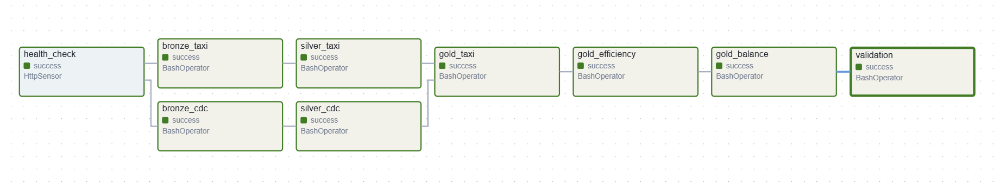
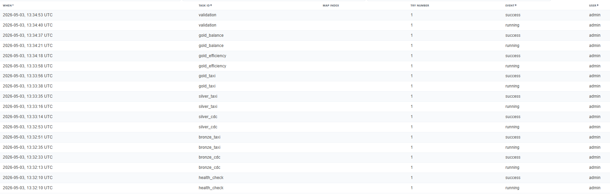

# Project 3 Report: CDC & Orchestrated Lakehouse Pipeline

## Setup

**step 1:** run these commands on host machine terminal
```shell
docker compose up -d
docker exec jupyter python /home/jovyan/project/seed.py
```

**step 2:** run these commands on host machine terminals
```shell
docker exec jupyter python /home/jovyan/project/produce.py --loop
docker exec jupyter python /home/jovyan/project/simulate.py
```

**step 3:** run this on jupyter terminal
```shell
curl -i -X POST -H "Accept:application/json" -H "Content-Type:application/json" \
http://connect:8083/connectors/ -d '{
  "name": "postgres-cdc-connector",
  "config": {
    "connector.class": "io.debezium.connector.postgresql.PostgresConnector",
    "tasks.max": "1",
    "database.hostname": "postgres",
    "database.port": "5432",
    "database.user": "cdc_user",
    "database.password": "admin",
    "database.dbname": "sourcedb",
    "topic.prefix": "dbserver1",
    "schema.include.list": "public",
    "table.include.list": "public.customers,public.drivers",
    "plugin.name": "pgoutput",
    "snapshot.mode": "initial"
  }
}'
```

run this command on host terminal to check if the previous command worked
```shell
curl http://localhost:8083/connectors/postgres-cdc-connector/status
```

**optional step:** if airflow login doesn't work, run this command to override login credentials
```shell
docker exec airflow airflow users reset-password -u admin -p admin
```

step 4: in airflow UI, go to admin->connections and create a new connection named kafka_connect if it doesn't exist
- Connection Id: kafka_connect
- Connection Type: HTTP
- Host: connect
- Port: 8083
- leave other fields as default

step 5: trigger DAG on Airflow UI

## 1. CDC Correctness
*   **Silver Matches PostgreSQL Source:** The pipeline successfully materializes the current state of the source database into the Silver Iceberg table. A `validate_silver` task queries the PostgreSQL database using `psycopg2`, queries the Iceberg table, and asserts that the total row counts are identical.
*   **Handling DELETEs:** Debezium tombstone events often have a null `after` payload. To capture these, the Bronze-to-Silver extraction logic uses `coalesce` to pull the ID from `$.payload.after.id` or `$.payload.before.id`. The `MERGE INTO` statement then applies the deletion to the Silver table using `WHEN MATCHED AND s.op = 'd' THEN DELETE`.
*   **Idempotency:** Re-running the pipeline without new source events yields the exact same Silver state. This is guaranteed by the deduplication logic, which isolates the latest event per primary key using `ROW_NUMBER() OVER (PARTITION BY id ORDER BY ts_ms DESC, lsn DESC)`. Including the PostgreSQL Log Sequence Number (`lsn`) ensures deterministic tie-breaking for rapid events occurring in the exact same millisecond.

## 2. Lakehouse Design
*   **Bronze CDC:** The schema is a single `value` column containing the raw JSON string of the Debezium envelope. This differs from the source because it is an append-only immutable log of every historical change event.
*   **Silver CDC:** The schema represents the materialized entity (`id INT`, `name STRING`, `email STRING`, `country STRING`, `ts_ms LONG`). It differs from Bronze by discarding historical versions and storing only the current, typed state of the data.
*   **Bronze Taxi:** Similar to Bronze CDC, this is an append-only table containing the raw JSON string payload from the Kafka `taxi-trips` topic.
*   **Silver Taxi:** Contains extracted and typed columns (`vendor_id`, `fare`, `pickup_time`). It differs from Bronze by enforcing data quality rules, such as filtering out records where `fare <= 0`.
*   **Gold Layers:** Tables like `gold_taxi` and `gold_assignment_efficiency` represent aggregate business metrics. They differ from Silver by grouping records (e.g., by `vendor_id` or `driver_id`) to compute metrics like total revenue, average fare per mile, and idle time.
*   **Iceberg Snapshot History Query:** `SELECT * FROM local.warehouse.silver_cdc.snapshots;`
*   **Time-Travel Query:** `SELECT * FROM local.warehouse.silver_cdc TIMESTAMP AS OF '<timestamp>';`

## 3. Orchestration Design


*   **Task Dependency Chain:** The DAG initiates with an `HttpSensor` (`health_check`) to confirm the Debezium connector is actively running. Upon success, `bronze_cdc` and `bronze_taxi` run in parallel to ingest raw Kafka streams. Following ingestion, `silver_cdc` and `silver_taxi` run in parallel to clean and deduplicate the data. Finally, downstream Gold tasks (`gold_taxi`, `gold_efficiency`, `gold_balance`) and the `validation` task execute only after the Silver layer is fully updated.
*   **Scheduling Strategy:** The DAG is configured with a `schedule_interval='@hourly'`. This batches Kafka streaming data into regular, idempotent micro-batches, supporting a 1-hour freshness SLA without the overhead of 24/7 continuous stream processing.
*   **Retry/Failure Handling:** The DAG specifies `retries: 2` with a `retry_delay: timedelta(minutes=1)`. 
    *   **Failure Example:** The `gold_efficiency` task initially failed due to a `[CANNOT_PARSE_TIMESTAMP]` error because the strict parser encountered a `'T'` in the ISO 8601 string. 
    *   **Recovery:** The extraction logic was updated to use the explicit format `"yyyy-MM-dd'T'HH:mm:ss"`. Because the Bronze tasks are append-only and Silver/Gold use `MERGE` or `OVERWRITE`, clearing the failed task in Airflow allowed it to cleanly recover and succeed without duplicating data.



## 4. Taxi Pipeline
*   **Correctness:** The Taxi pipeline correctly ingests raw JSON into Bronze, cleans invalid fares into Silver, and aggregates total revenue and trip counts by `vendor_id` in Gold.
*   **Improvements over Project 2:** The primary improvement is the shift from a standalone PySpark structured streaming script to an orchestrated, batched Lakehouse architecture via Apache Airflow. This allows the Taxi data to be reliably joined with slowly changing dimension data (CDC drivers) in a unified pipeline.

## 5. Custom Scenario: Driver Assignment Efficiency
The custom scenario required matching drivers to taxi trips using a `MOD` operation, calculating idle gaps, and profiling workload balance.

*   **Implementation:** The `process_gold_assignment_efficiency` task queries both `bronze_taxi` and `silver_cdc`. It uses Spark's `row_number()` window function to generate synthetic trip IDs, then applies `trip_id % active_drivers` to assign trips to CDC driver indices. To calculate `idle_seconds`, it partitions the data by driver and uses the `lag()` function over the `pickup` timestamp to find the gap between the previous drop-off and the current pickup.
*   **Key Findings:** 
    *   **Best Driver:** Driver ID `1104` achieved the best fare-per-mile ratio at `$6.84/mi`.
    *   **Workload Balance:** The assignment algorithm yielded a perfectly balanced workload. Across 679 active drivers, the standard deviation of assigned trips was merely `0.45`, and the Max/Min workload ratio was `1.0` (with drivers completing either 229 or 230 trips). Consequently, exactly 0 drivers were flagged as overloaded.
